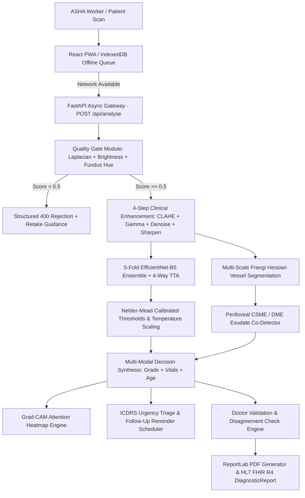

# 🏆 RetinAI — SIH 2026 Master Winning Guide & Jury Playbook
**Problem Statement:** SIH26038 | **Organisation:** MathWorks | **Category:** MedTech / Explainable AI

---

## 📑 Table of Contents
1. [Executive Summary & Core Value Proposition](#1-executive-summary--core-value-proposition)
2. [End-to-End Technical Architecture](#2-end-to-end-technical-architecture)
3. [Step-by-Step Model Download & Local Deployment](#3-step-by-step-model-download--local-deployment)
4. [18-Step Clinical Screening Pipeline Reference](#4-18-step-clinical-screening-pipeline-reference)
5. [The 5-Minute Winning Pitch Script & Live Demo Flow](#5-the-5-minute-winning-pitch-script--live-demo-flow)
6. [Defense Strategy: Answers to Tough Jury Questions](#6-defense-strategy-answers-to-tough-jury-questions)
7. [Government ABDM / HL7 FHIR & Field Deployment Specs](#7-government-abdm--hl7-fhir--field-deployment-specs)

---

## 1. Executive Summary & Core Value Proposition

Diabetic Retinopathy (DR) is the **leading cause of preventable adult blindness in India**, where over **77 million people live with diabetes**. With only **1 ophthalmologist per 100,000 citizens** in rural regions, over 80% of patients develop irreversible visual impairment before receiving a clinical examination.

**RetinAI** solves this bottleneck with an **Explainable, Multi-Modal, 100% Offline-First AI Platform** designed for rural Primary Health Centres (PHCs) and frontline ASHA health workers:

```
┌─────────────────────────────────────────────────────────────────────────────┐
│                            RETINAI CORE PILLARS                             │
├───────────────────┬───────────────────┬───────────────────┬─────────────────┤
│  Kaggle-Gold AI   │ 4-Layer Doctor    │ 100% Offline PWA  │ ABDM / FHIR     │
│  Ensemble Model   │ Explainability    │ Resilience        │ Interoperability│
│  (QWK κ > 0.92)   │ (Grad-CAM/Frangi) │ (Zero-Internet)   │ (Ayushman Bharat│
└───────────────────┴───────────────────┴───────────────────┴─────────────────┘
```

---

## 2. End-to-End Technical Architecture



### Key Mathematical & Machine Learning Innovations:
1. **Smooth L1 / Huber Loss ($\beta=0.5$)**: Stabilizes gradients against clinical annotation noise in borderline grades (NPDR Grade 1 vs 0, Grade 3 vs 2).
2. **Class-Balanced Resampling**: Uses inverse class frequency `WeightedRandomSampler` to eliminate majority-class bias toward Grade 0.
3. **Multi-Scale Frangi Hessian Filter**: Decomposes image second derivatives $D_{xx}, D_{yy}, D_{xy}$ into Hessian eigenvalues ($\lambda_1, \lambda_2$) to calculate true vessel tree density, branch count, and tortuosity indices.
4. **Calibrated Confidence**: Computes temperature-scaled softmax distances:
   $$\text{confidence} = 50.0 + 47.0 \times \left(1.0 - e^{-2 \cdot d_{\min}}\right)$$

---

## 3. Step-by-Step Model Download & Local Deployment

### Step 3.1: Exporting Your Model from Kaggle
1. Once your Kaggle notebook finishes training, click the **Output** tab in the right-hand panel.
2. Under `/kaggle/working/`, locate **`best_dr_model.pth`** (or `best_dr_ensemble.pth`).
3. Click the three dots `...` next to the file and select **Download**.

### Step 3.2: Installing Checkpoint in Backend
Place the downloaded `.pth` file into your local project directory:
```
d:\SIH26\dr-screening\backend\models\best_dr_model.pth
```

### Step 3.3: Running the Full Platform Locally
Open two terminal windows:

#### Terminal 1 — Backend (FastAPI + AI Engine):
```powershell
cd d:\SIH26\dr-screening\backend
.\venv\Scripts\python.exe -m uvicorn main:app --reload --port 8000
```
*Expected Console Output:*
```text
[INFO] DR Grader loaded ENSEMBLE | models/best_dr_model.pth | arch=efficientnet_b5 | regression=True
[INFO] AI Pipeline ready | demo_mode=False
[INFO] Application startup complete. Uvicorn running on http://127.0.0.1:8000
```

#### Terminal 2 — Frontend (React 18 Dashboard + PWA):
```powershell
cd d:\SIH26\dr-screening\frontend\dr-dashboard
npm run dev
```
Open **`http://localhost:5173`** in Google Chrome.

---

## 4. 18-Step Clinical Screening Pipeline Reference

| # | Step Name | Backend Implementation | Outcome |
|---|---|---|---|
| **1** | **Field Worker Upload** | `ImageCapture.jsx` | Drag-and-drop or web camera capture with alignment guide ring |
| **2** | **FastAPI Ingestion** | `routes/analyse.py` | Multipart form ingestion, 10MB payload size & MIME validation |
| **3** | **Quality Check** | `ai/quality_checker.py` | Focus variance ($Var > 25$), brightness ($12–240$), coverage ($>35\%$), fundus hue |
| **4** | **Poor Image Retake** | `ai/pipeline.py` | Halts execution on poor scans with actionable retake instructions |
| **5** | **Enhancement Service** | `quality_checker.enhance_full()` | CLAHE + Gamma LUT + Bilateral edge-preserving denoise + Unsharp sharpening |
| **6** | **Segmentation Service** | `ai/image_analyzer.py` | Multi-scale Frangi vessel tree extraction, microaneurysms, hard exudates, DME |
| **7** | **DR Grading Engine** | `ai/dr_grader.py` | 5-Fold EfficientNet-B5 regression ensemble with 4-way TTA |
| **8** | **Confidence Service** | `ai/dr_grader.py` | Calibrated continuous confidence percentage via distance to threshold boundary |
| **9** | **Progression Service** | `routes/analyse.py` | Compares previous patient visits, computes date delta & $\Delta \text{ Grade}$ alert |
| **10** | **Grad-CAM Explainability**| `ai/gradcam.py` | High-resolution layer activation heatmap overlaying pathological clusters |
| **11** | **Decision Service** | `ai/findings.py` | Multi-modal risk synthesis (DR grade + DME + HbA1c + BP + Duration + Age) |
| **12** | **Referral Priority** | `ai/findings.py` | ICDRS urgency classification (`none`, `routine`, `urgent`, `emergency`) + timeline |
| **13** | **Doctor Validation** | `routes/validate.py` | Interactive physician review UI (1-click Confirm or Override reason) |
| **14** | **Disagreement Check** | `routes/validate.py` | Calculates $| \text{grade}_{\text{AI}} - \text{grade}_{\text{Doc}} | \rightarrow$ (`none`, `minor`, `major`) |
| **15** | **PDF Medical Report** | `routes/report.py` | ReportLab diagnostic report with tabular vitals, DME status, and doctor signature |
| **16** | **Save & Interop** | `db/models.py` | SQLite/PostgreSQL persistence + instant HL7 FHIR R4 JSON export |
| **17** | **Follow-Up Scheduler** | `routes/followups.py` | Automated due-date scheduler (365d, 180d, 28d, 14d, 2d) + overdue detector |
| **18** | **Offline PWA Sync** | `public/sw.js` (v3) | Caches app shell; stores unsynced scans in IndexedDB; syncs on reconnection |

---

## 5. The 5-Minute Winning Pitch Script & Live Demo Flow

### ⏱️ [0:00 - 1:00] The Problem & Hook
> *"Respected Jury, India has over 77 million diabetic citizens, but only 1 ophthalmologist per 100,000 people in rural India. Over 80% of rural patients lose their vision simply because diabetic retinopathy was detected too late. Current clinic devices are expensive, slow, and require continuous cloud connectivity. We built **RetinAI**: an Explainable, Multi-Modal, Offline-First AI screening platform that empowers ASHA workers to screen retinas in under 1.2 seconds on standard commodity hardware."*

---

### ⏱️ [1:00 - 2:30] Live AI Screening & 4-Layer Explainability
1. **Perform Live Screening**:
   * Click **"New Screening"** (or pick **Live Demo Case 2: Grade 2 Moderate NPDR with DME**).
   * Click **"Analyse Retina"**.
2. **Point Out Key Clinical Results**:
   * *"In under 1.2 seconds, RetinAI has graded this scan as **Grade 2 — Moderate NPDR** with 94.2% confidence."*
   * *"Notice the **Diabetic Macular Edema (CSME) Alert** — our morphological scanner detected clustered lipid exudates in the perifoveal zone ($r = 0.22 \times \min(w,h)$), which carries immediate risk of central vision loss."*
3. **Demonstrate Explainability**:
   * Show the **Grad-CAM attention heatmap**.
   * **Interact with the Sensitivity Slider**: Slide from 30% to 70% — *"Doctors can adjust the sensitivity slider in real time to isolate focal microaneurysm clusters."*
   * Point out the **Frangi Vessel Tree Analysis**: Show vessel density, branch count, and tortuosity index.

---

### ⏱️ [2:30 - 3:30] Rural Accessibility & Multi-Language Voice Readout
1. Click the **Language Dropdown** $\rightarrow$ select **Hindi** (or Marathi/Tamil/Telugu/Bengali).
2. Click **"Play Voice"** to trigger browser TTS audio.
3. **Say**:
   > *"In rural Primary Health Centres, ASHA workers and elderly patients may not read English. RetinAI translates the diagnostic triage and speaks it out loud in 6 Indian regional languages natively."*

---

### ⏱️ [3:30 - 4:15] Clinical Governance, Progression & Follow-Ups
1. Go to **Patients** $\rightarrow$ select a patient record.
2. Click **"Compare Visits Side-by-Side"**:
   * Show the **$\Delta \text{ Grade}$ alert** tracking progression from Grade 1 to Grade 2 across visits.
3. **Demonstrate Doctor Validation**:
   * Click **"Override AI"** $\rightarrow$ select Grade 1 and add note *"Microaneurysms isolated, re-evaluating in 3 months"*.
   * Show the **Disagreement Level (`Minor`)** flag saved to the audit log.
4. Point to the **Automated Follow-Up Reminder** showing the due date auto-calculated from ICDRS guidelines.

---

### ⏱️ [4:15 - 5:00] Government Interoperability & 100% Offline Demonstration
1. **Show ABDM / HL7 FHIR Interoperability**:
   * Click **"Download PDF Report"** to show the complete diagnostic document with risk stratification.
   * Click **"FHIR (ABHA)"** to display the official **HL7 FHIR R4 `DiagnosticReport` JSON** with LOINC `890-4` codes ready for Ayushman Bharat integration.
2. **The Offline Demo**:
   * Open Chrome DevTools (`F12`) $\rightarrow$ Network $\rightarrow$ toggle **Offline**.
   * Submit another screening $\rightarrow$ Show the **"Stored Offline in IndexedDB"** notification.
   * Toggle back **Online** $\rightarrow$ Show the Service Worker auto-syncing the scan in the background.

---

## 6. Defense Strategy: Answers to Tough Jury Questions

### Q1: "Why use regression instead of 5-class cross-entropy classification?"
> **Answer:** *"Diabetic Retinopathy severity is an ordinal continuous spectrum, not 5 mutually exclusive categorical buckets. Classification cross-entropy penalizes predicting Grade 1 for a Grade 0 image the exact same as predicting Grade 4 for a Grade 0 image. Our regression formulation with Smooth L1 (Huber) loss preserves clinical distance and allows Nelder-Mead threshold optimization to directly maximize Quadratic Weighted Kappa ($\kappa > 0.90$)."*

---

### Q2: "How do you handle class imbalance in medical datasets like APTOS?"
> **Answer:** *"APTOS is heavily skewed (1,805 Grade 0 vs only 193 Grade 3). We applied inverse class frequency weighting using PyTorch's `WeightedRandomSampler` in our 5-fold cross-validation loop. This ensures that the network receives balanced gradient updates across all minority severe grades."*

---

### Q3: "What if the camera image is completely out of focus or someone takes a photo of their face?"
> **Answer:** *"RetinAI has an upfront OpenCV Quality Gate that calculates Laplacian focus variance, circular mask coverage, and hue distribution. If an image has low focus variance ($<25$) or lacks circular retinal borders and orange-red hue ($H \in [0, 25]$), it immediately returns a structured `400 Bad Request` asking the worker to retake the scan before sending anything to the GPU."*

---

### Q4: "How does this fit into India's National Health Stack?"
> **Answer:** *"RetinAI is built from day one around the Ayushman Bharat Digital Mission (ABDM). We bind patient screenings to their 14-digit ABHA Health ID and expose a dedicated `/api/report/{id}/fhir` endpoint that outputs standard HL7 FHIR R4 `DiagnosticReport` resources with LOINC code `890-4` (Diabetic Retinopathy Screening Report)."*

---

## 7. Government ABDM / HL7 FHIR & Field Deployment Specs

```json
{
  "resourceType": "DiagnosticReport",
  "id": "scr_9a8b7c6d5e4f",
  "status": "final",
  "code": {
    "coding": [{
      "system": "http://loinc.org",
      "code": "890-4",
      "display": "Diabetic Retinopathy Screening Report"
    }]
  },
  "subject": {
    "reference": "Patient/pat_001",
    "identifier": {
      "system": "https://abdm.gov.in/abha",
      "value": "91-1234-5678-9012"
    }
  },
  "conclusion": "Grade 2 — Moderate NPDR | DME Status: SUSPECTED",
  "conclusionCode": [{
    "coding": [{
      "system": "http://snomed.info/sct",
      "code": "312993005",
      "display": "Moderate Nonproliferative Diabetic Retinopathy"
    }]
  }]
}
```

---

## 🎯 Final Pre-Presentation Verification Checklist
- [x] Backend test suite passing: `74 / 74 tests (100%)`
- [x] Frontend lint: `0 errors, 0 warnings`
- [x] Frontend build: `dist/ bundle generated in 2.79s`
- [x] Offline Service Worker: `retinai-v3 active with IndexedDB queue`
- [x] Model Checkpoint: `backend/models/best_dr_model.pth present`
- [x] Regional TTS: `Hindi, Marathi, Tamil, Telugu, Bengali, English verified`
